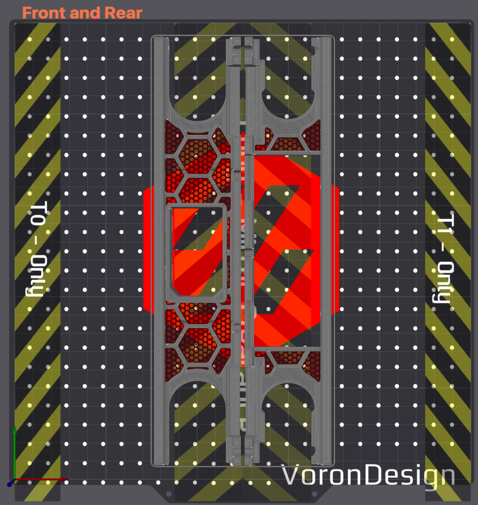

# Multi Skirts

Skirts designed to be printed with a multi-material or toolchanger setup. I It might be possible to do this with manual filament changes, but I have concerns about warping given the size of the parts.

## Settings

* SOLID objects:
    * Voron Part Settingss
* Inserts objects:
    * See [Instructions](#Instructions)

## Instructions

Import the step files found in the [CAD](./CAD/) directory into your slicer (I'll be demonstrating using OrcaSlicer on my Tridex).

In the objects menu, select the filaments for your skirts.

Modify the following print settings for each **Inserts** object:
1. Walls: 0
1. Top layers: 0
1. Bottom layers: 0
1. Infill Density: 25% **(this can be modified per your liking)**
1. Infill Pattern: Honeycomb **(this can be modified per your liking)**
1. Infill direction: 0 **(this will change depending on how you orient your parts)**

Results should look like this:
